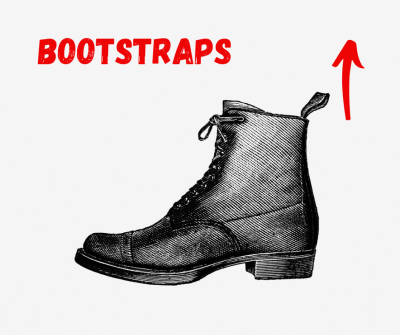

```{r setup, include=FALSE}
knitr::opts_chunk$set(message = FALSE, warning = FALSE)
```

This document is based on Efron and Tibshirani, *An Introduction to the Bootstrap* (1993), Efron and Hastie, *Computer Age Statistical Inference* (2021), Kosuke Imai's (Harvard) lecture note, and past section notes by previous TAs, Aaron Rudkin and Ciara Sterbenz.


## The Bootstrap
 - The randomization inference exploits the randomness induced by treatment assignment while data fixed to get sampling distribution and its standard deviation, i.e., standard errors. But the application of RI is limited in that we can't justify its use unless we know the *exact* treatment assignment mechanism (randomization procedure, blocking, clustering, probability of receiving treatment for all units, etc.) RI is justified only by the fact that we know how treatment is randomized, so it's difficult to use outside of experimental world.
 
 - Another approach that is way easier to understand and implement is the "bootstrap." What if we utilizes the variation in a given sample data--because we expect our sample to roughly look like our population, why not treat our sample as our population, and take many samples from that instead? In a <span style="color:red;">bootstrap</span>, we try to approximate a sampling distribution by repeated sampling **with replacement** (randomly selecting data and allowing for duplicates) from a population that is similar to the population of interest---the set of observations in data! Thus, bootstrap generate a number of *pseudo*-samples from the original sample. For this reason, the bootstrap is a *resampling* method.
 
 - Why "Bootstraps": “to improve your position and get out of a difficult situation by your own efforts, without help from other people” (Longman Dictionary)
 
<p align="center">
  
</p>  


## Formal treatment
 - We have unknown data generating process, $Y_i \stackrel{i.i.d.}{\sim} F$, where $F$ is a probability distribution. A sample statistic $\hat{\theta}$ is computed by applying some formula $g(\cdot)$ (e.g., sample mean $\frac{1}{n}\sum_i Y_i$, or Difference-in-Means, etc.) to $Y$, i.e., $\hat{\theta} = g(Y_1, \cdots, Y_n)$, and we want to get the standard error $\sqrt{V_F (\hat{\theta})}$. That is, we wish to estimate the standard deviation of $\hat{\theta}$ we would observe by repeatedly sampling new versions of $Y$ from the data generating process $F$.
 
 - Theoretical calculation of the standard error is difficult since $F$ is unknown. So bootstrap approximates $F$ with $\hat{F}$ by direct simulation! The bootstrap standard error then will be $\sqrt{V_{\hat{F}} (\hat{\theta})},$ where $\hat{F}$ is the empirical CDF (Cumulative Distribution Function)---we put equal probabilities $\frac{1}{n}$ at each value in the sample data (FYI, imagine we plot a histogram of sample data. To get the eCDF, we're just "manually" integrating--order data by values, and stack from left to right, drawing a histogram but in a cumulative way!)
 
 - Let's call $Y^*=(Y_1^*, \cdots, Y_n^*)$ be *bootstrap sample* where each $Y_i^*$ is drawn randomly with equal probability and with replacement from the sample data $Y$. We can simulate a lot of $Y^*$ with computer, say we got some arbitrarily large number $B$ of independent bootstrap samples. Then we can compute our statistic for each bootstrap sample, $\hat{\theta}_b^*=g(y_b^*)$ for $b=1, 2, \cdots, B$. Estimating the parameter $\theta$ using sample analog $\hat{\theta}$ is called **<span style="color:red;">plug-in principle</span>**. The empirical distribution of $\hat{\theta}^*=(\hat{\theta}_1^*, \cdots, \hat{\theta}_B^*)$ is our (bootstrap) sampling distribution.
  \begin{align*}
   \text{<Real World>:} \qquad &F \stackrel{i.i.d.}{\Longrightarrow} Y_1, \cdots, Y_n \stackrel{g}{\Longrightarrow} \hat{\theta} \\
   \text{<Bootstrap World>:} \qquad &\hat{F} \stackrel{i.i.d.}{\Longrightarrow} Y_1^*, \cdots, Y_n^* \stackrel{g}{\Longrightarrow} \hat{\theta}_b^* \equiv g(Y_1^*, \cdots, Y_n^*)
  \end{align*}
  
 - Bootstrap standard error: the resulting bootstrap estimate of standard error of $\hat{\theta}$ is the standard deviation of $\hat{\theta}_b^*$: $$\hat{se}(\hat{\theta}) = \frac{1}{B-1} \sum_{b=1}^B \left( \hat{\theta}_b^* - \frac{1}{B} \sum_{b'=1}^{B} \hat{\theta}_b^* \right)^2.$$
 
 - Asymptotically, the bootstrap standard error approximates the sampling distribution well with large $B$ (usually $B=200$ is sufficient):
 $$V_F(\hat{\theta}) \underbrace{{\approx}}_{\substack{\text{may not be small}\\ \text{depends on iid, }n}} V_{\hat{F}}(\hat{\theta}) \underbrace{{\approx}}_{\substack{\text{small}\\ \text{when large }B }} \hat{se}_{boot}$$
 
 - Bootstrap percentile confidence intervals: to obtain the $(1-2\alpha)$ confidence intervals of $\theta$, we take the $100 \cdot \alpha/2^{\text{th}}$ and $100 \cdot (1-\alpha/2)^{\text{th}}$ percentiles of $\hat{\theta}^*$ (e.g., when $\alpha=0.05$: the estimate for 95\% CI is $2.5^{\text{th}}$ and $97.5^{\text{th}}$ values of $\hat{\theta}_b^*$.) If sample size is large, we can build CIs in usual way, with using bootstrap standard error to compute CIs (this method relies on the normal approximation like t-CIs.)
 
 - One variant of the bootstrap is *parametric* bootstrap. When we have a good parametric assumptions on the data $Y$ and the data generating process $F$ (e.g., "Ok, I know it's normal!"), we could use parametric bootstrap. That is, we believe that a few parameters governs the whole data generating process: so what we need to know for inference are those parameters. The same as bootstrap, but now we replace $\hat{F}$ with $F_{\hat{\theta}}$, where $\theta$ denotes general model parameters (e.g., mean $\mu$ and sd $\sigma$ for Normal distribution) and $\hat{\theta}$ is point-estimated values for those parameters. The conceptual scheme is now   
 \begin{align*}
   \text{<Real World>:} \qquad &F_{\color{red}{\theta}} \stackrel{i.i.d.}{\Longrightarrow} Y_1, \cdots, Y_n \stackrel{g}{\Longrightarrow} \hat{\theta} \\
   \text{<Parametric Bootstrap World>:} \qquad &F_{\color{red}{\hat{\theta}}} \stackrel{i.i.d.}{\Longrightarrow} Y_1^*, \cdots, Y_n^* \stackrel{g}{\Longrightarrow} \hat{\theta}_b^* \equiv g(Y_1^*, \cdots, Y_n^*).
  \end{align*}

 <br>

```{r, echo=FALSE}
set.seed(8675309)
i <- 1:100
```


Here is population. So, our $f$ here is $\text{Multinomial}(100, (\frac{1}{3}, \frac{1}{3}, \frac{1}{3}))$. Should we knew this code, we would be able to learn everything about the population (but can't).
```{r}
population <- sample(c(1, 2, 3), 100, replace=TRUE)
population
```

Here is our data $Y=(Y_1, \cdots Y_{10})$. We will use it to get our empirical version of data generating process, that is $\hat{F}$.

```{r}
first_sample <- sample(population, 10, replace=FALSE)
```

Then bootstrap samples.

```{r}
bs_replicate <- sample(first_sample, 10, replace=TRUE)
```

We can see the analogy--Population : Sample :: Sample : Bootstrap Samples.

```{r animation.hook='gifski', echo=FALSE, fig.align='center'}
library(tidyverse)
library(gifski)
x <- i %% 10 # %% is modular division -- integer-divide i by 10 and return the remainder 
y <- ceiling(i / 10)

for(i in 1:8) {
  #plot template and population
  par(mar=c(2.1, 1.1, 2.1, 1.1))
  plot(x, y,
       main = "Bootstrap: The Idea",
       col=population, pch = 16, xlim = c(0, 20), ylim = c(0.5, 11.5),
       yaxt = "n", xaxt = "n", xlab = "", ylab = "")
  abline(v = 10, col = "black")
  text(x = 5, y = 11, "Our Population (by F)")
  
  #draw sample data
  points(11:20, rep(10, 10), col = first_sample, pch=16)
  text(x = 15, y = 11, expression(paste("Our Sample Data (", Y, ")")))
  
    for(j in seq(1.5, 10.5, 1)){ #lines demarcating each b
      lines(c(10, 20), c(j, j))
    }
  
  #draw bootstrap samples
  text(x = 15, y = 9, expression(paste("Bootstrap Replicates (", Y, "*), B=8")))
  points(11:20, rep(9-i, 10), col = sample(first_sample), pch = 16)
}

#last result
par(mar=c(2.1, 1.1, 2.1, 1.1))
  plot(x, y,
       main = "Bootstrap: The Idea",
       col=population, pch = 16, xlim = c(0, 20), ylim = c(0.5, 11.5),
       yaxt = "n", xaxt = "n", xlab = "", ylab = "")
  abline(v = 10, col = "black")
  text(x = 5, y = 11, "Our Population (by F)")
  points(11:20, rep(10, 10), col = first_sample, pch=16)
  text(x = 15, y = 11, expression(paste("Our Sample Data (", Y, ")")))
  for(j in seq(1.5, 10.5, 1)){ #lines demarcating each b
    lines(c(10, 20), c(j, j))
  }
  #draw bootstrap samples
  for(i in 1:8){
  text(x = 15, y = 9, expression(paste("Bootstrap Replicates (", Y, "*), B=8")))
  points(11:20, rep(9-i, 10), col = sample(first_sample), pch = 16)
}
``` 


## Why does bootstrapping work?

 - Bootstrapping is a very simple statistical procedure that relies on some very complicated results. The simple version is that it is similar to the <span style="color:red;">Weak Law of Large Numbers (WLLN)</span>: 1) sampling distribution of any sample statistic is entirely determined by the CDF and $n$, and 2) WLLN says that the eCDF will look more and more like the CDF as $n$ gets large. With a little more complexity, the <span style="color:red;">Dvoretzky-Kiefer-Wolfowitz</span> inequality says that **as samples get larger, their empirical cumulative distribution functions (eCDF) rapidly approach convergence with the CDF of their source distribution.**

 - Resampling from sample data is basically equivalent to drawing from $\hat{F}$, which is an empirical CDF. In the plot below, the eCDF of the sample data is in black, and eCDF of bootstrap samples are in red. Look how fast our sample starts looking like our population.

```{r echo=FALSE}
set.seed(19401009)
```

```{r}
complicated_data <- as_tibble(c(rnorm(100, 5, 1.5),
                                rnorm(35, 10, 3),
                                runif(20, 0, 2.5),
                                -1, -0.9, -1, -1, 1, 20))
```

```{r animation.hook='gifski', echo=FALSE, fig.align='center'}
ggplot(complicated_data, aes(value)) +
  stat_ecdf(geom = "step", size=1.2, alpha=.6) +
  labs(title="Empirical CDF of Data Converges to Source CDF", x="Value", y="Quantile") +
  theme_minimal()

for(i in seq(5, 160, 5)){
  simple_sample <- sample(complicated_data$value, i, replace=FALSE)
  #WARNING: don't forget to wrap up all the plotting code with `print` function!!
  print(ggplot(complicated_data, aes(value)) +
          stat_ecdf(geom = "step", size=1.2, alpha=.5) +
          stat_ecdf(data=tibble(value=simple_sample), aes(value), geom = "step", 
                    col="red") +
          labs(title=paste0("Empirical CDF of Data Converges to Source CDF, Size ", i), 
               x="Value", y="Quantile") +
          theme_minimal())
}
```


## How to implement bootstrap
 - To characterize the uncertainty of our estimator given data at hand via bootstrap:
1. Take a sample of size $n$ from our sample *with replacement*. (This means that each unit from your sample might appear in the resample zero times, one time, or many times.)
2. Estimate our estimator on each bootstrap sample.
3. Repeat steps 1 and 2 many times ($B$ times), forming a sampling distribution for our estimator.
4. Use the sampling distribution of the estimator (bootstrap distribution) to conduct inference: e.g., calculate the standard error and get a percentile confidence interval.

 <br>
 
*** 

## Examples of Bootstrap with R
### 1. Nonparametric Bootstrap

 - Let's look at some real data--this is from the U.S. National Health Interview Study, and we're going to treat it as our population ($N = 4,347$). Let's use non-parametric bootstrap (resample data *without* any distributional/model assumption on DGP) to assess the standard error of **sample mean** and **sample median** of `Height`.

```{r}
library(tidyverse)
#data
health_data <- read.csv("height_data.csv")
health_data <- health_data %>% filter(height <= 76)
nrow(health_data) #we'll treat it as population data with n=4,347

#Sample estimate of mean height and median/mean height
sample_data <- sample_n(health_data, size = 100) #draw our sample n=100
observed_mean <- mean(sample_data$height)
observed_median <- median(sample_data$height)

#let's make a function for obtaining bootstrap sampling distribution of mean & median
boot_samp_dist <- function(data, B){
  replicate(B, { #B: number of reps
    #1. get bootstrap sample (note: resample indices, not data themselves for efficient computation)
    indices <- sample(1:nrow(data), nrow(data), replace=TRUE) 
    boot_samp <- data[indices, "height"] #using row indices
    #2. estimate our statistics (mean/median) on each bootstrap sample and collect them
    boot_mean <- mean(boot_samp)
    boot_median <- median(boot_samp)
    c(boot_mean = boot_mean, boot_median = boot_median) #return them as a vector
  }, simplify = FALSE) %>% bind_rows() #collect to form a sampling distribution
}

#3. repeat steps 1 and 2 `rep` times -> boot samp dist.
boot_dist <-boot_samp_dist(data=sample_data, B=500) #B=500
```

Here is an animated plot showing the construction of the bootstrap sampling distribution for each step.

```{r, echo=FALSE, fig.align='center'}
library(gganimate)
library(magick)
#animated plot to visualize construction of bootstrap sampling distribution.

#The idea is to split by row and then accumulate rows to frames, 
#i.e. in frame 1 only row 1 is shown, in frame 2 rows 1 and 2 are shown, and so on.
#1. for sample mean
b_dist_ani_df <- tibble(est = boot_dist$boot_mean, b=1:length(boot_dist$boot_mean)) %>%
  group_split(b) %>% 
  accumulate(~ bind_rows(.x, .y)) %>% 
  bind_rows(.id = "frame") %>%
  mutate(frame = as.integer(frame))

mean_gif <- b_dist_ani_df %>% 
  ggplot(aes(x=est)) +
  geom_histogram(alpha=.7) +
  geom_vline(aes(xintercept = observed_mean), col="red", linetype="dashed") + 
  labs(title="Bootstrap Sampling Distribution of Sample Mean", x="Height (Inches)") +
  theme_minimal() +
  transition_manual(frame)

#2. for sample median
b_dist_ani_df2 <- tibble(est = boot_dist$boot_median, b=1:length(boot_dist$boot_median)) %>%
  group_split(b) %>% 
  accumulate(~ bind_rows(.x, .y)) %>% 
  bind_rows(.id = "frame") %>%
  mutate(frame = as.integer(frame))

median_gif <- b_dist_ani_df2 %>% ggplot(aes(x=est)) +
  geom_histogram(alpha=.7) +
  geom_vline(aes(xintercept = observed_median), col="red", linetype="dashed") + 
  labs(title="Bootstrap Sampling Distribution of Sample Median", x="Height (Inches)") +
  theme_minimal() +
  transition_manual(frame)

#encode to gif
gif_Mean <- animate(mean_gif, width=600, height=450, fps=15, end_pause=40)
gif_Median <- animate(median_gif, width=600, height=450, fps=15, end_pause=40)

#combine the animated plots to juxtapose
a_gif <- image_read(gif_Mean)
b_gif <- image_read(gif_Median)

new_gif <- image_append(c(a_gif[1], b_gif[1]))
for(i in 2:60){
  combined <- image_append(c(a_gif[i], b_gif[i]))
  new_gif <- c(new_gif, combined)
}

#then animate it!
new_gif
```

Again, the standard error of an estimator is the standard deviation of the sampling distribution.

```{r}
##4. Inference for sample mean
#standard error
se_mean_boot <- sd(boot_dist$boot_mean)
se_mean_boot
```

A confidence interval for $\hat{\theta}$ can be constructed using the standard normal confidence interval procedure. Another (purely nonparametrical) approach is percentile intervals: to take the quantiles of the bootstrap sampling distribution of $\hat{\theta^*_b}$. For example, 95\% percentile confidence interval is $$\hat{\theta}^*_{b, (lower)} < \theta < \hat{\theta}^*_{b, (upper)},$$ where the $\hat{\theta}^*_b$ are the $B$ ordered bootstrap replicates, and $\hat{\theta}^*_{b, (lower)} = .025 \cdot B$ and $\hat{\theta}^*_{b, (upper)} = .975 \cdot B$ (There are some approached to improve bootstrap intervals: for example, "bias-corrected, accelerated" or "BCa" adjusts for bias and skewness in the bootstrap distribution; see Efron and Tibshirani book.) 


```{r}
#confidence intervals using percentile method
quantile(boot_dist$boot_mean, c(0.05/2, 1-0.05/2))

#CIs via normal approximation
mean(boot_dist$boot_mean) + c(qnorm(0.025), qnorm(0.975))*se_mean_boot
```

Ok, let's compare bootstrap standard error and percentile CIs to analytic solutions ($se(\bar{X}) = \sqrt{\frac{Var(X)}{n}}$).

```{r}
#standard error of sample mean
se_est <- sqrt(var(sample_data$height)/nrow(sample_data))
se_est

#t CIs of sample mean
observed_mean + c(-qt(1-.05/2, df=nrow(sample_data)-1), qt(1-.05/2, df=nrow(sample_data)-1))*se_est
```

Here is a more general function for bootstrap using base R style.

```{r}
#Source: Efron and Hastie (2021) `Algorithm 10.1` with modification
Boot <- function (x, B, func, ...){
  # x is data vector or matrix (with each row a case)
  # B is number of bootstrap replications
  # func is R function that inputs a data vector or matrix and returns a numeric number or vector
  # ... other arguments for func
  x <- as.matrix(x)
  n <- nrow(x)
  f0 = func(x, ...) #to get size of would-be estimate
  fmat <- matrix(0, length(f0), B)
  for (b in 1:B) {
    i <- sample(1:n, n, replace = TRUE) #resample indices
    fmat[, b] <- func(x[i, ], ...)
  }
  drop(fmat) 
}

sd(Boot(x=sample_data$height, B=500, func = mean)) #standard error of sample mean
sd(Boot(x=sample_data$height, B=500, func = median)) #standard error of sample median

#Boot function is flexible in that we can feed our custom function
#say our weird estimator is median of weight/height ratio
estimate_function <- function(data){
  median(data[, 1]/data[, 2])  
}
sd(Boot(x=cbind(sample_data$weight, sample_data$height), B=500, func=estimate_function))
```

The `boot` function in `boot` package is good when you have a simple bootstrap and a clear function which returns a quantity of interest. At the moment, it's more important to understand how it works with line by line code so I'll skip it. We'll use the package later in the course whenever we need to use bootstrap.

 <br>

### 2. Parametric Bootstrap

 - Suppose we are confident that Height is normally distributed. We could use parametric bootstrap: we use point estimated sample mean and sample sd using the data for our parameter values. That is, now we draw directly from the assumed parametric model derived from the sample $F_{\color{red}{\hat{\theta}}} =N( \color{red}{\hat{\mu}}, \color{red}{\hat{\sigma}})$ rather than observations themselves (or their empirical CDF). If our model is sufficiently good to represent the true data generating process, the parametric bootstrap would be valid.
 
 - The Height example continues. We have Height data $$Y_i \overset{iid}{\sim} N(\mu, \sigma),$$ for $i=1, \cdots, n$, and we set $n=100$. The observed estimate of mean is $\hat{\theta}=g(Y)=\frac{\sum_i Y_i}{n}$. We plug in our estimates for the parameters of normal distribution as $\hat{\mu}=\bar{Y}$ and $\hat{\sigma}=s$, where $\bar{Y}$ is sample mean and $s$ is sample sd. Then a parametric bootstrap sample is $$Y_i^* \overset{iid}{\sim} N(\bar{Y}, s),$$ for $i=1, \cdots, n$ and $\hat{\theta}^*_b = g(Y^*)=\sum_i Y_i^*$ is a bootstrap sample mean computed from $Y_i^*$. $B$ bootstrap sample would give the sampling distribution of $\hat{\theta}^*_b$.

```{r}
## parametric bootstrap with Normal model
#parameter estimates (MLE)
mu_hat <- mean(sample_data$height) #plug-in sample mean for mu_hat
sigma_hat <- sd(sample_data$height) #sample variance for sigma_hat

#get parametric bootstrap samples: just plug-in observed parameter values and draw B times
par_boot_samples <- replicate(500, { #B=500, same as nonparametric case for illustration
    mean(rnorm(100, mean = mu_hat, sd = sigma_hat)) #n=100, same size as sample data
  }, simplify = TRUE) #bootstrap dist of sample mean, output as a vector

sd(par_boot_samples) #parametric bootstrap standard error
```

 <br>

### 3. Block (Clustered) Bootstrap: when i.i.d. is violated at unit level

 - The block boostrap is used to handle clustering when we have a complicated sampling structure that samples larger units (e.g., classroom, school, district, village, household, etc.) i.i.d., but within a cluster takes individual draws that are not i.i.d. For example, we sample i.i.d. districts in California, then within a district we collect the test scores of all students in the 6th grade--not i.i.d.!--and take the mean. 
 
 - If you have experimental data and blocked assignment, or data contain clustered structure, you should **resample the clusters (not units!) with replacement**. This method is called the <span style="color:red;">block/cluster bootstrap</span>, which is exactly like the bootstrap except that now we resample whole clusters rather than individual units. To conduct the (non-parametric) block bootstrap:

1. Take a with replacement sample of $\#\{ \text{clusters} \}$ clusters from our sample, keeping clusters intact.
2. Calculate our would-be estimate using this collected $n$ observations in our block bootstrap sample.
3. Repeat steps 1 and 2 many times, forming a sampling distribution for our estimator.
4. Use the sampling distribution of the estimator (block bootstrap distribution) to conduct inference: calculate the standard error, get a percentile confidence interval, etc.
 
 <br>
 
Let's take an example. Does school enrollment impact academic performance? Let's regress the academic performance index in 2000 (`api00`) on the total enrollment at a school (`enroll`), with two covariates, the percentage of fully qualified teachers (`full`) and the percentage of students eligible for subsidized meals (`meals`): $$y_i = \beta_0 + \beta_1 \cdot enroll_i + \beta_2 \cdot full_i + \beta_3 \cdot meals_i + \epsilon_i$$ The regression coefficient $\beta_1 = \beta_{\text{enroll}}$ is our quantity of interest.

Note that the `apiclus1` dataset is made by cluster sampling--random sampling of 15 entire districts than schools, and each observation is individual school. We might think that there are district specific factors that lead to distinct academic performance, and hence the schools within same district are not independent.

How to get the standard error for something this complicated? Just replicate the exact sampling design and estimation in a bootstrap!


<p align="center">
  
</p>


```{r}
library(survey) #to get api data
library(stargazer)
data(api)

#15 districts
unique(apiclus1$dnum)

#make a function for block/cluster bootstrap
block_boot_lm <- function(B, data, cluster, formula){
  boots <- replicate(B, {
    #1. get sample of CLUSTERS (not units) with replacement
    clusters <- sample(unique(data[, cluster]), replace=TRUE)
    #for each sampled cluster, build up a new dataset -> bootstrap data
    boot_data <- map_df(clusters, function(x){
      data[data[, cluster] == x, ] #`data[, cluster]==x` returns row indices vector; then sample
    })
    #2. estimate regression coefficients on each bootstrap sample and collect them
    boot_lm <- lm(formula, data = boot_data) #one bootstrap statistic/estimate
    return(as_tibble( t(coef(boot_lm)))) #transpose to make it row vector, to stack row-wise
  }, simplify = FALSE) %>% bind_rows() #bootstrap distribution
  return(boots)
}

#run a regression on original data: "observed" estimates
lm_res <- lm(api00 ~  enroll+meals+full, data=apiclus1)
#obtain block bootstrap distribution
block_boot_lm_res <- block_boot_lm(1000, apiclus1, "dnum", api00 ~ enroll+meals+full) #B=1,000

#compare to nominal standard error
block_boot_se <- apply(block_boot_lm_res, 2, sd) #compute standard deviation for each coefficient
names(block_boot_se) = names(lm_res$coefficients)
stargazer(lm_res, lm_res, type="text",
          title="Regression with and without Clustered SEs",
          se = list(sqrt(diag(vcov(lm_res))), block_boot_se),
          dep.var.labels="Academic Performance Index in 2000",
          column.labels = c("Nominal", "Cluster-Bootstrap"),
          omit.stat=c("LL", "ser", "f"), no.space=TRUE)
```

Finally, here is our block bootstrap sampling distribution of the regression coefficient of `enroll` variable, compared to simple bootstrap method.

```{r}
##Comparison of sampling distibution
#simple bootstrap for lm
boot_lm <- function(B, data, formula){
  boots <- replicate(B, { #B: number of reps
    #1. get bootstrap sample (note: resample indices, not data themselves for efficient computation)
    indices <- sample(1:nrow(data), nrow(data), replace=TRUE) 
    boot_data <- data[indices, ] #using row indices
    #2. estimate reg coef on each bootstrap sample and collect them
    boot_lm <- lm(formula, data = boot_data) #our bootstrap distribution
    return(as_tibble( t(coef(boot_lm)))) #transpose to make it row vector, to stack row-wise
  }, simplify = FALSE) %>% bind_rows()
  return(boots)
}
boot_lm_res <- boot_lm(1000, apiclus1, api00 ~ enroll+meals+full) #B=1,000
apply(block_boot_lm_res, 2, sd)
```

```{r, echo=FALSE, eval=FALSE, fig.align='center'}
compare <- tibble(Simple=boot_lm_res$enroll, Block=block_boot_lm_res$enroll) %>% 
  gather(Method, est)

#plot
ggplot(compare, aes(x=est)) +
  geom_histogram(alpha=.7) +
  facet_wrap(~Method) +
  geom_vline(aes(xintercept = lm_res$coefficients["enroll"]), col="red", linetype="dashed") + 
  labs(title="Block/Simple Bootstrap Sampling Distribution", x=expression(hat(beta)["enroll"])) +
  theme_minimal()
```

```{r, echo=FALSE, fig.align='center'}
#1. for simple bootstrap
df_simple <- tibble(est = boot_lm_res$enroll, b=1:length(boot_lm_res$enroll)) %>%
  group_split(b) %>% 
  accumulate(~ bind_rows(.x, .y)) %>% 
  bind_rows(.id = "frame") %>%
  mutate(frame = as.integer(frame))

gif_simple <- df_simple %>% 
  ggplot(aes(x=est)) +
  geom_histogram(alpha=.7) +
  geom_vline(aes(xintercept = lm_res$coefficients["enroll"]), col="red", linetype="dashed") + 
  labs(title="Simple Bootstrap Distribution of Regression Coefficient", 
       x=expression(hat(beta)["enroll"])) +
  theme_minimal() +
  transition_manual(frame)

#2. for block bootstrap
df_block <- tibble(est = block_boot_lm_res$enroll, b=1:length(block_boot_lm_res$enroll)) %>%
  group_split(b) %>% 
  accumulate(~ bind_rows(.x, .y)) %>% 
  bind_rows(.id = "frame") %>%
  mutate(frame = as.integer(frame))

gif_block <- df_block %>% 
  ggplot(aes(x=est)) +
  geom_histogram(alpha=.7) +
  geom_vline(aes(xintercept = lm_res$coefficients["enroll"]), col="red", linetype="dashed") + 
  labs(title="Block Bootstrap Distribution of Regression Coefficient", 
       x=expression(hat(beta)["enroll"])) +
  theme_minimal() +
  transition_manual(frame)

#encode to gif
gif_Simple <- animate(gif_simple, width=600, height=450, fps=15, end_pause=40)
gif_Block <- animate(gif_block, width=600, height=450, fps=15, end_pause=40)

#combine the animated plots to juxtapose
c_gif <- image_read(gif_Simple)
d_gif <- image_read(gif_Block)

new_lm_gif <- image_append(c(c_gif[1], d_gif[1]))
for(i in 2:60){
  combined <- image_append(c(c_gif[i], d_gif[i]))
  new_lm_gif <- c(new_lm_gif, combined)
}

#then animate it!
new_lm_gif
```


### Quick review quiz
Q. Say we have a boostrapped sampling distribution of mean estimates from our bootstrapped samples, how do we calculate the SE estimate? What about the usual SE estimate?

a. `sd(boot_sampling_distribution)/sqrt(nrow(sample_data))`
b. `sd(boot_sampling_distribution)/B`
c. `sd(boot_sampling_distribution)`
d. `sd(sample_data)`
e. `sd(sample_data)/sqrt(nrow(sample_data))`


## Summary
 - We characterize the variability of our estimates (any sample statistic) by standard error, the standard deviation of the sampling distribution of estimates.
 
 - At its core, statistical inference is about obtaining sampling distribution. We learned two approaches: Randomization inference gives randomization distribution by resampling treatment assignment; Bootstrap gives bootstrap distribution by resampling data with replacement. With sampling distribution, you can make statistical inference--getting standard errors and confidence intervals, conducting hypothesis testing with null distribution, etc.
 
 - Answer: c and e, respectively.


