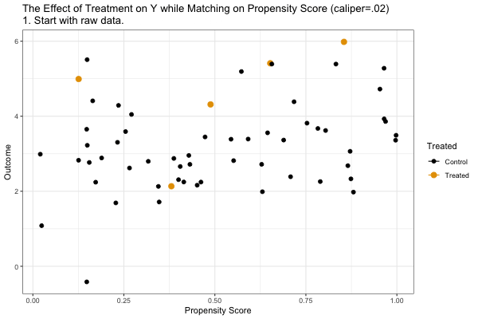

```{r setup, include=FALSE}
knitr::opts_chunk$set(message = FALSE, warning = FALSE, fig.align = 'center')
```
\newcommand{\y}{\mathbf{y}}
\newcommand{\X}{\mathbf{X}}
\newcommand{\E}{\mathbb{E}}
\newcommand{\V}{\mathbb{V}}
\newcommand{\independent}{\perp\!\!\!\perp}


This document is based on Imbens and Rubin, *Causal inference in statistics, social, and biomedical sciences* (2015), Elizabeth Stuart, *Matching Method sfor Causal Inference: A Review and a Look Forward* (Statistical Science, 25(1), 2010) and the lecture slides of Kosuke Imai and Brandon Stewart.


## SOO brief review
***

 - We invoke the **<span style="color:red;">conditional ignorability</span>** (selection on observables; SOO) assumption: $$ \{ Y_{0i}, Y_{1i} \} \independent D_i|X_i=x \; \text{ for any } \; x \in \chi,$$ which means that "among units with same values of covariates $X_i$, $D_i$ is "as-if" randomly assigned. In other words, the conditional distribution of potential outcomes is identical across levels of the treatment once we condition on the covariates $X$ (recall stratified/block randomized experiment, or "conditional experiment": "we effectively run a separate experiment within each stratum of $X$", but now allowing for continuous $X$s).

 - We also need the **<span style="color:red;">common support (positivity)</span>** assumption: $$0<\Pr(D_i=1|X_i=x)<1 \; \text{ for any } \; x \in \chi,$$ which means that "with any value of $X_i$, unit could have received either treatment or  control."
 
 - Identification of $ATE$ under conditional ignorability:
 $$
 \begin{align*}
 \tau_{ATE} &= \E[Y_{1i} - Y_{0i}] \\
 &= \E_X[\E[Y_{1i} - Y_{0i} | X_i]]    &\text{(law of iterated expectation)} \\
 &= \int \underbrace{\E[Y_{1i} - Y_{0i}|X_i=x]}_{\tau(x):\text{ATE among subgroup }X_i=x} f(x)dx  &\text{(definition of } \E) \\
 &= \int \{ \E[Y_{1i}|X_i=x] - \E[Y_{0i}|X_i=x] \} f(x)dx  &\text{(linearity of }\E) \\
 &= \int \{ \E[Y_{1i}|X_i=x, \color{red}{D_i=1}] - \E[Y_{0i}|X_i=x, \color{red}{D_i=0}] \} f(x)dx  &\text{(conditional ignorability + common support)} \\
 &= \int \{ \E[Y_i|X_i=x, D_i=1] - \E[Y_i|X_i=x, D_i=0] \} f(x)dx  &\text{(consistency, SUTVA)}\\
 &= \E_X [ \overbrace{ \underbrace{\E[Y_{i}|X_i=x, D_i=1]}_{\text{weighted mean of treated w/ }X_i=x} - \underbrace{\E[Y_i|X_i=x, D_i=0]}_{\text{weighted mean of control w/ }X_i=x} }^{\text{Conditional Expectation Function; let's call it } \hat{\tau}(x)} ]\\
 &= \E_X [\hat{\tau}(x)].
 \end{align*}
 $$
 Recall that regression can be used as just an estimator for conditional expectation function ("agnostic" view). Thus, ATE can be identified with regression function, $$\hat{\tau}(x) = \E[Y_i|D_i=1, X_i=x] - \E[Y_i|D_i=0, X_i=x],$$ where $\hat{\beta}_{D}$ would capture the average treatment effect.
 
 - The identification result for ATT ($\E[Y_{1i}-Y_{0i}|D_i=1]$) is similar, but replace $f(x)$ with $f(x|D_i=1)$: for ATT, we now take expectation with respect to the distribution of $X_i$ given $D_i=1$ (instead of the marginal distribution of $X$).

 <br>
 <br>

## Advantage of Matching as an estimation strategy
***
 - It's worth repeating: identification precedes estimation. Let’s say that we know that ignorability holds conditional on observed covariates $X_i$. That is, we can get reasonable answer with our data (we can identify) for our target quantity (estimand). Then how can we "estimate" the estimand? Or, what is the best way to obtain an estimate with "adjusting for" $X_i$? Some broad approaches, which overlap in part but also have fundamental differences, include **matching**, **weighting**, and **regression adjustment**.
 
 - Ignorability justifies a causal claim we make, matching does not. Matching doesn't make identification assumptions more plausible; theoretical concerns and domain knowledge does. However, matching has two benefits: 1) it can simplify the analysis of causal effects (no complicated statistical modeling required, if covariates are well-balanced), and 2) it can reduce dependence of estimates on parametric models.

 - Then why use matching? Given the proper set of observed confounders (i.e., assuming SOO), matching is an **estimation** strategy that helps **<span style="color:red;">reduce model dependence</span>**.

 - **Ho, Imai, King, Stuart, Matching as Nonparametric Preprocessing for Reducing Model Dependence in Parametric Causal Inference** ([2007](https://www.cambridge.org/core/journals/political-analysis/article/matching-as-nonparametric-preprocessing-for-reducing-model-dependence-in-parametric-causal-inference/4D7E6D07C9727F5A604E5C9FCCA2DD21)), Fig.1:
 
```{r, echo=FALSE, fig.align='center', fig.width = 10, fig.height=5}
library(MatchIt)
library(scales)
load("Ho_et_al_figure_1.Rdata")

## Ho, Imai, King, Stuart (2007): fig.1, Political Analysis
lm.all1 <- lm(y ~ t+x, data=dta)
lm.all2 <- lm(y ~ t+x+I(x^2), data=dta)
temp <- matchit(t ~ x, data=dta)
matched <- match.data(temp)
lm.m1 <- lm(y ~ t+x, data=matched)
lm.m2 <- lm(y ~ t+x+I(x^2), data=matched)

plot.pts <- seq(from=min(dta$x),to=max(dta$x),by=0.1)
plot.pts2 <- seq(from=5, to=24, by=0.1)

par(mar=c(2, 2, 2, 2) + 0.1, cex.lab=0.7, cex.axis=0.5,
    mgp=c(1,0.5,0), cex.main=0.8, cex=1, mfrow=c(1,2), bg="white")
plot(dta$x[dta$t==1],dta$y[dta$t==1],pch="T", col="red",
     xlim=range(dta$x), ylim = range(dta$y),
     xlab="X", ylab = "Y", cex=0.8, main="Before Matching")
points(dta$x[dta$t==0],dta$y[dta$t==0],pch="C", cex=0.8, col="blue")
abline(lm.all1$coef[1] + lm.all1$coef[2], lm.all1$coef[3], lty=1, col="red", lwd=1.5)
abline(lm.all1$coef[1], lm.all1$coef[3], lty=1, col="blue", lwd=1.5)
lines(plot.pts, lm.all2$coef[1] + lm.all2$coef[2] +
     lm.all2$coef[3]*plot.pts + lm.all2$coef[4]*plot.pts^2,
      lty=2, col="red", lwd=1.5)
lines(plot.pts, lm.all2$coef[1] + lm.all2$coef[3]*plot.pts +
      lm.all2$coef[4]*plot.pts^2, lty=2, col="blue", lwd=1.5)
legend(5, 4.75, lty=c(1, 1, 2, 2), col=c(1, 8, 1, 8), lwd=1.5,
               legend=c("Linear Model, Treated Group", "Linear Model, Control Group",
                 "Quadratic Model, Treated Group", "Quadratic Model, Control Group"), cex=0.5)
plot(matched$x[matched$t==1], matched$y[matched$t==1],
     pch="T", xlab="X", ylab="Y", col="red", xlim=range(dta$x),
     ylim=range(dta$y), cex=0.8, main="After Matching")
points(matched$x[matched$t==0], matched$y[matched$t==0], pch="C", cex=0.8, col="blue")
points(dta$x[temp$weights==0 & dta$t==0],
       dta$y[temp$weights==0 & dta$t==0],
       pch="C", col=alpha("blue", 0.4), cex=0.8)
lines(plot.pts2, lm.m1$coef[1] + lm.m1$coef[2] + lm.m1$coef[3]*plot.pts2, lty=1, col="red", lwd=1.5)
lines(plot.pts2, lm.m1$coef[1] + lm.m1$coef[3]*plot.pts2, lty=1, col="blue", lwd=1.5)
lines(plot.pts2, lm.m2$coef[1] + lm.m2$coef[2] +
      lm.m2$coef[3]*plot.pts2 + lm.m2$coef[4]*plot.pts2^2,
      lty=2, col="red", lwd=1.5)
lines(plot.pts2, lm.m2$coef[1] + lm.m2$coef[3]*plot.pts2 +
      lm.m2$coef[4]*plot.pts2^2, lty=2, col="blue", lwd=1.5)
legend(5, 4.75, lty=c(1, 1, 2, 2), col=c(1, 8, 1, 8), lwd=1.5,
       legend=c("Linear Model, Treated Group", "Linear Model, Control Group",
         "Quadratic Model, Treated Group", "Quadratic Model, Control Group"), cex=0.5)
```

 - **<span style="color:red;">Reducing model dependence</span>** and **<span style="color:red;">ensuring common support</span>**: without matching, the model we select for the relationship between $X_i$ and $Y_i$ will affect the estimates---we get different model fit for linear model and quadratic model with $X_i^2$ term, and moreover the effect estimate has opposite sign (positive to negative). It's mainly due to control units that different from treated units in $X_i$, which would be "pruned" by matching. In other words, matching "balances" observed covariates across treatment groups, i.e., $P(X_i=x|D_i=1) = P(X_i=x|D_i=0, \text{matched})$.


 <br>
 <br>

## Idea
***
 - Any method that aims to  "balance" the  distribution of covariates in the treated and control groups can be called "matching."
 
 - Individaul treatment effect for **treated unit** $i$ is $$\tau_i = \underbrace{Y_i}_{\text{observed}} - \underbrace{Y_{0i}}_{\text{unobserved}}.$$ Matching tries to estimate untreated potential outcomes of treated units $Y_{0i}|D_i=1$ with observed outcome of matched control units $Y_{j, \text{matched}}|D_j=0, $. In other words, we specify the correct *counterfactual* for each treatment unit from control group. We also discard ("prune") nonmatches to reduce covariate imbalance.
 
 - Estimand: ATT, $\E[Y_{1i} - Y_{0i}|\color{red}{D_i=1}, X_i]$ (for each treated units, match them with "similar" control units, and discard the rest---so it's Average Treatment effect on Treated).
 
 - Estimation: $$\hat{\tau}_{match}  = \frac{1}{n_1} \sum_{i=1}^{n} (Y_i - \frac{1}{|M_i|} \sum_{i' \in M_i}Y_{i'}),$$ where $M_i$ is the **<span style="color:red;">"matched set"</span>** for treated unit $i$.


 <br>
 <br>
 
 
## Matching in Action: An Empirical Example
***
 - **Urban and Niebler, Dollars on the Sidewalk: Should U.S. Presidential Candidates Advertise in Uncontested States?** ([2014](https://onlinelibrary.wiley.com/doi/abs/10.1111/ajps.12073))
 
 - Goal: estimating the effect of political advertisements on campaign contributions
 
 - Practice: interpret research in potential outcomes framework
     + Unit $i$: zip codes, only in noncompetitive states
     
     + Outcome $Y_i$: total campaign contributions for 2008 election campaign
     
     + Treatment $D_i$: 1 if zip code receives "spillover" campaign ads (>$1,000) from adjacent battleground states sharing a media market, 0 otherwise.
     
     + (Measured) Confounders $X_i$: zip code level characteristics (income, race composition, education level, etc.)
     
     + Selection on Observables (conditional ignorability) $\{ Y_{1i}, Y_{0i} \} \independent D_i|X_i$: $$ \{\text{Contribution}_{\text{ads}, i}, \text{Contribution}_{\text{no ads}, i} \} \independent \text{Ads}_i | X_i,$$ which means that the potential campaign contributions from treated zip codes and from control zip codes are independent from receiving ads conditional on covariates
     
     + Common support $0 < \Pr(D=1|X) < 1$: for zip codes with any level of (combinations of) covariates, there is a positive probability of receiving the spillover ads
     
     + In regression: $Cont_i = \beta_0 + \beta_1 Ads_i + \beta_2 Income_i + \beta_3 Education + \cdots + \epsilon_i$

 
 - Exploits *boundary mismatch*:
     + Focus on noncompetitive states, since there are other intensitve campaign events in competitive states (speeches, campaign offices, and rallies); but they wanted to rule out any campaign activities other than ads
     
     + While there is no intentional advertising in noncompetitive states, some areas of these states receive "spillover ads" from competitive states, as the boundaries of media markets do not align directly with state borders (sort of "natural" experiment where treatment is as-if randomized)


 - Let's see what "model dependence" means more specifically. We'll collect most of possible model specifications (all combinations of predictors; excluding interaction terms for simplicity), compute the treatment effect for each, and look at the variability in the estimate across model specifications.
 
 - We'll use `MatchIt` package instead of `Matching`, to get you some exposure to another software option. The main advantage of this package is that the functions in it does matching, then users can do any outcome analysis on matched dataset.
 
 - The covariates (at zip code level) are:
     + `Inc`: median household income
     + `PercentHispanic`: percent hispanic
     + `PercentBlack`: percent African Americans
     + `density`: population density
     + `per_collegegrads`: percent college graduates

```{r}
library(MatchIt)
library(haven)
library(tidyverse)
library(knitr)
library(kableExtra)
library(grid)
library(gridExtra)
library(ebal)
library(cobalt) # Easy love plots

#Data
data <- read_dta("urban_niebler_2014/data/FECForCEM.dta")
unique(data$state) #only noncompetitive states
data <- data %>%
  mutate(treat = ifelse(TotAds >= 1000, 1, 0), #treatment: receiving spillover ads
         Inc_sq=Inc^2, College_sq=per_collegegrads^2, #squared terms
         zip = as.double(zip))
data_ca <- data %>% filter(state == "California") #select only California cases
#Note: We have to pick one state, as we haven't learned "fixed effects"; we need fixed effect model
#to account for huge difference in outcome / treatment effect across states
#We'll use data_ca for all the analyses except for model-dependency plot, since small n 
#leads to extreme model-sensitivity. So whole data will be used for that purpose

#list all combinations of predictors (excluding polynomials and interactions)
covariates <- c("Inc", "PercentHispanic", "PercentBlack", "density", "per_collegegrads")
covariates_sq <- c("Inc", "PercentHispanic", "PercentBlack", "density", "per_collegegrads", 
                "Inc_sq", "College_sq")
all_model <- map(1:7, function(x) {combn(covariates_sq, x)})

#make regression formulas for each combination (each comb. is a matrix column so we apply over columns)
all_model_form <- map(all_model, 
                      function(x) {apply(x, 2, function(y) paste(y, collapse = "+"))})
                         
#add treatment to each regression formula
all_model_form_with_t <- map(all_model_form,
                             function(x) {map(x, function(y) as.formula(paste("Cont ~ treat +", y)))})

#e.g., some example when we include 2 confounders
head(all_model_form_with_t[[2]], 2)

#results in following count of combinations for a regression with 1, 2, ..., 5 confounders
map_dbl(1:7, function(x) {length(unlist(all_model_form_with_t[[x]]))})

#run every model specifications
all_model_lm <- map(all_model_form_with_t,
                    function(x) map(x, function(y) (lm(y, data = data)))) #x, y: regression formulas

#get coefficient and p-value on treatment (ads)
all_coef <- map(all_model_lm,
                function(x) map(x, function(y) coefficients(y)["treat"]))
all_pv <- map(all_model_lm,
                function(x) lapply(x, function(y) summary(y)$coefficients["treat", 4]))
```

When the estimate of treatment effect (coefficient on the treatment variable) differs across model specifications, we could consider it as the evidence that the estimated treatment effect is highly dependent on model itself. In other words, the researcher's choice on which predictors are included in the model would change the inference, which reduces the credibility of the conclusion.

```{r, echo=FALSE}
#plot: red dashed vertical lines are for full model with 7 covariates
g_est <- ggplot(tibble(est = unlist(all_coef)), aes(x=est)) +
  geom_density(alpha=.7) + 
  #full linear model with all covariates
  geom_vline(xintercept = coefficients(all_model_lm[[7]][[1]])["treat"], col="red", linetype="dashed") +
  labs(x="Estimated treatment effect") +
  xlim(c(-10, 3)) +
  theme_minimal() +
  theme(axis.ticks.y=element_blank(), axis.title.y=element_blank())

g_pv <- ggplot(tibble(pvalue = unlist(all_pv)), aes(x=pvalue)) +
  labs(x="P-value of estimated treatment effect") +
  geom_density() +
  geom_vline(xintercept = .05, col="red", linetype="dashed") + 
  xlim(c(0, 1)) +
  theme_minimal() +
  theme(axis.ticks.y=element_blank(), axis.title.y=element_blank())

grid.arrange(g_est, g_pv, 
             top = textGrob("Distribution of Treatment Effect / P-value across 127 specifications",
                            gp=gpar(fontsize=15)),
             left = textGrob("Density of model specification", rot = 90, vjust = 1), ncol=2)
```

 - Before delving into matching procedure, let's do eyeballing matching by just looking at the data to get some intuition. Remember that matching is to find right "counterfactual," i.e., controls with similar features, for each treatment unit. Let's pick up a treatment unit (unfortunately, all the treated zip codes are around the CA-NV border, so not that familiar...), Toms Place in Reno media market, and find a good counterfactual for it from control pool.

```{r, echo=FALSE}
#map of treat/contrl & zip codes
library(rgdal)
library(plyr)
library(ggrepel)
#shape file obtained from: https://www.census.gov/cgi-bin/geo/shapefiles/index.php?year=2010&layergroup=ZIP+Code+Tabulation+Areas
#93546: Toms Place / 90034: Palms / 93545 Lone Pine / 90024: Westwood
chosen <- tibble(zip = c(93546, 93545, 90024, 90034),
                 city = c("Toms Place", "Lone Pine", "Westwood", "Palms")) %>%
  mutate(cities)
data_ca <- data_ca %>% left_join(chosen, by = "zip")

#setup
sp <- readOGR("shapefile_ca_zip")
sp@data$id <- rownames(sp@data)
sp.df     <- fortify(sp)
sp.df     <- join(sp.df,sp@data, by="id") 
sp.df <- sp.df %>% 
  mutate(GEOID10 = as.character(GEOID10)) %>% 
  mutate(zip = as.double(ZCTA5CE10)) %>% 
  left_join(chosen, by="zip")

#state shape data
ca_sp <- map_data("state") %>% filter(region=="california")

#4 chosen cities with zip code
positions <- aggregate(cbind(long, lat) ~ zip,
                       data=sp.df %>% filter(zip %in% chosen$zip), FUN=mean) %>%
  left_join(chosen %>% dplyr::select(zip, city), by="zip") %>% 
  mutate(city_with_zip = paste0(city, " (", zip, ")"))

#boundary map
ggplot(sp.df %>% mutate(treat = as_factor(ifelse(zip %in% data_ca[data_ca$treat==1, ]$zip,
                                                 "Treated", "Control"))),
       aes(long, lat, group = group)) +
  geom_polygon(aes(fill=treat), col = alpha("white", .5), size=.2) +
  geom_polygon(data=ca_sp, colour = "black", fill = NA, size=0.3) +
  coord_map() + theme_void() +
  scale_fill_manual(values=c("Treated"="red", "Control"="grey80")) +
  geom_text_repel(data=positions, aes(long, lat, label=city_with_zip),
                  inherit.aes=FALSE, size=3, fontface = "bold",
                  nudge_x = c(-3, -.5, 2.5, 1), nudge_y = c(0, -1, 1, 1.5))
```

```{r}
#unit of observation: zip code / unit of treatment: local media market
#Toms Place was treated with spillover ads likely from targeting of Reno media markets since
#it's close to state border between CA/NV

#93546: Toms Place / 90034: Palms / 93545 Lone Pine / 90024: Westwood
data_ca %>% 
  filter(zip==93546|zip==90024|zip==90034|zip==93545) %>% 
  dplyr::select(zip, Cont, treat, Market, covariates) %>% 
  kable(booktabs = T, digits=4, align = rep('c', 6),
        col.names = c("Zip", "Cont.", "$D_i$", "Market", "Inc", 
                      "% Hisp", "% Black", "Pop Den", "% College")) %>%
  row_spec(1, color = "blue") %>% 
  column_spec(3, background = "lightgrey") %>% 
  kable_styling(full_width = F, position = "center", font_size = 15)
```

 - 90034 (Palms): not even close in any covariate.
    
 - 93545 (Lone Pine): more than anything, close in density. But lower income and college education.
    
 - 90024 (Westwood): close in income (suprisingly), but double college education, and uncomparable density.
    
 - It seems difficult to find a good "conterfactual" Toms Place (maybe too atypical area in California). Better let R find it.


 <br>
 <br>


#### Check the covariate balance in the unmatched dataset

First, it's a good idea to check the initial imbalance in variables before matching. We could use visual inspection of covariate distributions between treatment and control group.

```{r}
library(reshape2) #for `melt` function
data_ca %>% dplyr::select(treat, all_of(covariates)) %>%
  mutate(abd = as_factor(ifelse(treat==1, "Treaed", "Control"))) %>%
  mutate(density = log(density)) %>% 
  melt(all_of(covariates), id.vars = "treat") %>% #make it "long format" for plotting
  ggplot(aes(x = value)) +
  geom_density(aes(col = as_factor(treat))) +
  facet_wrap(~ variable, scales = "free") +
  labs(title=paste0("PDF of Covariates by Treatment Status"), 
       y="Density",col = "Treatment") +
  labs(col = "Treatment", x = "Value (note: only density is log-scaled)") +
  theme_minimal() +
  theme(axis.text.y = element_blank(), axis.ticks.y = element_blank())
```

Another way to check balance is to compare summary statistics for each covariate between the treatment group and control group. The `method` argument is for specifying the method of matching to be performed, but we set `method = NULL` to let R know that we just assess balance prior to matching.

```{r}
# We can specify a formula using `paste` function for use later
balance_formula <- as.formula(paste("treat ~ ", paste(covariates, collapse=" + ")))
balance_formula

# We don't match here; just construct a pre-match matchit object
m_out_pre <- matchit(balance_formula, data = data_ca, method = NULL, distance = "mahalanobis")
summary(m_out_pre)
```

 <br>
 <br>


### Matching
***
 - Matching procedure
     1. Choose a set of covariates to match on (too many covariates suffers from curse of dimensionality)
     2. Choose a number of matches ($1:1$ or $M:1$ where  $M>1$), whether to match with replacement or not
     3. Choose a distance metric (Mahalanobis distance, propensity score, etc. w/ or w/o caliper)
     4. Find matches (and drop non-matches)
     5. Check balance
     6. Repeat 1-4 until balance is acceptable
     7. Compute the treatment effect in the matched dataset (we can do the exact same analysis we would have done using the original data, but using the matched data instead)

### Choices we need to make
 1. **Choose a set of covariates to match on**
     + Matching relies on conditional ignorability (SOO), so include all confounders to satisfy the assumption. For obvious reason, outcome variable should not be included in matching process. Another type of variable that should not be included is any variable that may have been affected by the treatment (posttreatment variables)

 2. **Choose a number of matches** ($1:1$ or $M:1$ where  $M>1$), whether to match **with replacement or not**
     + 1:1 without replacement (simplest)
     
 3. **Choose a distance metric** (2 common measures are Mahalanobis distance and propensity score)
 - **<span style="color:red;">Mahalanobis distance</span>**:
     + The idea is that we want to compute the distance between between two cities in some covariates. But we have multiple covariates, so need some summary measure of distance, Moreover, we standardize the distance via dividing by the covariance matrix (think about "standard" normal distribution):
     $$MD(\mathbf{X}_i, \mathbf{X}_j) = \sqrt{(\mathbf{X}_i, \mathbf{X}_j)^{T} \tilde{\Sigma}^{-1} (\mathbf{X}_i, \mathbf{X}_j)},$$ where $\mathbf{X}_i$  is a $(n \times k)$ matrix containing the value of each $k$ covariates of unit $i$, and $\tilde{\Sigma}$ is the sample variance-covariance matrix.
     
     + Intuitively, if the variables in data are strongly correlated then the covriance will be large. Dividing by a large covariance will effectively reduce the raw distance. If the variables are loosely correlated, the covariance is small and the distance is not reduced much. As a result, after transformation by $\tilde{\Sigma}^{-1}$, we can just compute distance as if data is in uncoreelated unit-variance space where Euclidean distance is valid.
     
     + For example, $\tilde{\Sigma}$ in our dataset: (when we calculate distance between units) less important to have small distance between income/college because two variables are highly correlated; more important between income and density since they are loosely correlated. Mahalanobis distance takes account for variables' relative importance by scaling $\mathbf{X}$.

```{r}
cor(data_ca[, covariates])
```

 - **<span style="color:red;">Propensity score</span>**: 
     + such distance measure are problematic in multidimensional covariates due to "curse of dimensionality." When we have too many variables to match on, it's hard to find "close enough" matches. One alternative is using (estimated) propensity score, as a one-dimensional summary: $$D(\mathbf{X}_i, \mathbf{X}_j) = |\widehat{\pi(\mathbf{X}_i)} - \widehat{\pi(\mathbf{X}_j)}| = |\Pr(\widehat{D_i=1}|\mathbf{X}_i) - \Pr(\widehat{D_i=1}|\mathbf{X}_j)|,$$ where $\pi(\mathbf{X}_i)=\Pr(D_i=1|\mathbf{X}_i)$ is propensity score for unit $i$, the probability of receiving the treatment.
     
     + Is it justifiable to use just one number as an approximation for multiple covariates (dimension reduction)? Yes, since propensity score is a "balancing score": conditioning on propensity score, the treatment is independent of covariates: $$D_i \independent \mathbf{X}_i | \pi(\mathbf{X}_i),$$ which reads that among those units with the same propensity score, covariates $\mathbf{X}_i$ is identically distributed between the treated and untreated. 
     
     + If SOO ($\{ Y_{0i}, Y_{1i} \} \independent D_i|X_i=x$) holds, then conditional ignorability also holds given the propensity score: $\{ Y_{0i}, Y_{1i} \} \independent D_i|\pi(\mathbf{X}_i)$. Stratifying on propensity score is the same as stratifying on the full covraties $\mathbf{X}_i$, in expectation.
     
 <br>
 <br>

 - First example: estimand is ATT (for each treated unit, find similar controls), 1:1 match without replacement, nearest-neighbor in Mahalanobis distance

```{r}
library(cobalt)
# match it: 1:1 without replacement, nearest-neighbor in Mahalanobis distance, estimand is ATT
m_out_mahal <- matchit(balance_formula, data = data_ca, estimand = "ATT", 
                       ratio = 1, #1-to-1 matching
                       replace = FALSE, #without replacement
                       distance = "mahalanobis", method = "nearest")

# Summary table: balance improvement,  number of control units matched to treated units
summary(m_out_mahal)

#let's see how matching was conducted
head(get_matches(m_out_mahal) %>% select(id, subclass, weights, zip, treat), 6)
```

Don't forget to check balance after matching: good balance on average, but overall distribution is still not well-balanced.

```{r}
# Check if covariate balance has been improved by matching
#mean seems good; whole dist (ks test stat) is still bad
bal.tab(m_out_mahal, un=TRUE, stats = c("m", "ks"), binary = "std")
love.plot(m_out_mahal, stat=c("m", "ks"), binary = "std")
```

### Estimating the treatment effecs
 - First, extract the matched dataset from the `matchit` object using `match.data()`. It only has matched units with columns for distance, weights, and subclass.
     
 - Then, with matched data, 1) estimate simple (weighted) Difference-in-Means or 2) estimate regression model that we would have used in the first place.
     
 - Note: in any case, it is recommended to use *cluster-robust standard errors* since matched pairs have "pair membership" (e.g., if treated unit 1 matched with control unit 1, then they form a cluster). The `subcalss` contains pair membership. (but some others argue that it's not necessary)
 
```{r}
library(estimatr) #to use SO CONVENIENT function `lm_robust`
## Estimating ATT in matched dataset
m_data <- match.data(m_out_mahal)
head(m_data %>% dplyr::select(zip, Cont, treat, weights, subclass) %>% arrange(subclass))

# 1. Estimate simple (weighted) difference in means between treatment and control
# Don't forget to cluster standard errors by matchied pair
dim_matched <- lm_robust(Cont ~ treat, data=m_data, weights=weights, clusters = subclass)
dim_matched

#using `lmtest` and `sandwich`
#library("lmtest")
#library("sandwich")
#fit1<-lm(Cont ~ treat, data = m_data, weights = weights)
#coeftest(fit1, vcov. = vcovCL, cluster = ~subclass)

# 2. Linear regression with covariates on matched set
covariates
lm_robust(Cont ~ treat+Inc+PercentHispanic+PercentBlack+density+per_collegegrads,
          data=m_data, weights=weights, clusters = subclass)
```

 <br>

### Another distance metric (1-dim!): propensity score


 - Idea: we match treated and control units who have similar propensity scores.

<p align="center">

</p>

(Animation credit: Nick Huntington-Klein. Note: technically, it's not "nearest-neighbor" matching we'll use; it illustrates a matching with a caliper of 0.02, but gives a good intuition)


```{r}
#propensity score matching
m_out_ps_1to1 <- matchit(balance_formula, data = data_ca, estimand = "ATT", 
                         ratio = 1, #1-to-1 matching
                         replace = FALSE, #without replacement
                         #distance measure is propensity score estimated by logistic regression
                         distance = "glm", link = "logit", method = "nearest")

#much better balance!
love.plot(m_out_ps_1to1, stat=c("m", "ks"))
bal.plot(m_out_ps_1to1, var.name="distance", #distance is propensity score here
         which="both") #before and after PS matching

#estimate ATT in matched dataset
m_data_ps_1to1 <- match.data(m_out_ps_1to1)
dim_ps_1to1 <- lm_robust(Cont ~ treat, data=m_data_ps_1to1, weights=weights, clusters = subclass)
dim_ps_1to1
lm_robust(Cont ~ treat+Inc+PercentHispanic+PercentBlack+density+per_collegegrads, 
          data=m_data_ps_1to1, weights=weights, clusters = subclass) %>% tidy() %>% filter(row_number()==2)
```

 <br>

#### What about $M:1$ matching? The previous 1:1 matching involved pairing only one control unit with each treated unit. In California case we have a large pool of control relative to treated, so we might want to use $M:1$ matching. Say we're using 3:1 matching. The `ratio` argument is now set to 3.
     + Pros: it preserves precision by preventing too many control units from being discarded from the matched set.
     + Cons: selecting more than one controls for each treated unit (increasing $M$) might increase bias because the 2nd and 3rd nearest matches are by definition further away from the treated unit than is the 1st nearest match.
     
     + Thus, generally, selecting the number of matches involves a bias-variance trade-off. It seems that the advantage outweigh the disadvantage for our case, since treatment group is too small but control group is huge.

```{r}
m_out_ps_3to1 <- matchit(balance_formula, data = data_ca, estimand = "ATT", 
                         ratio = 3, #3-to-1 matching
                         replace = FALSE, #without replacement
                         #distance measure is propensity score estimated by logistic regression
                         distance = "glm", link = "logit", method = "nearest")

#let's see how 3-to-1 matching was conducted
head(get_matches(m_out_ps_3to1) %>% select(id, subclass, weights, zip, treat), 12)

#estimate ATT in matched dataset
m_data_ps_3to1 <- match.data(m_out_ps_3to1)
lm_robust(Cont ~ treat, data=m_data_ps_3to1, weights=weights, clusters = subclass)
lm_robust(Cont ~ treat+Inc+PercentHispanic+PercentBlack+density+per_collegegrads, 
          data=m_data_ps_3to1, weights=weights, clusters = subclass) %>% tidy() %>% filter(row_number()==2)
```

 - Let's compare estimates and standard errors before/after matching with various matching methods. Matching reduced bias in regression approach by improving covariate balance.
 
```{r, echo=FALSE}
## compare estimates
formula1 <- as.formula("Cont ~ treat")
formula2 <- as.formula("Cont ~ treat+Inc+PercentHispanic+PercentBlack+density+per_collegegrads")

rbind(Raw_Data = lm_robust(formula2, data=data_ca) %>% tidy() %>% .[2, 2:3],
      mahal_1to1 = lm_robust(formula2, data=m_data, weights=weights, clusters = subclass) %>% 
        tidy() %>% .[2, 2:3],
      ps_1to1 = lm_robust(formula2, data=m_data_ps_1to1, weights=weights, clusters = subclass) %>% 
        tidy() %>% .[2, 2:3],
      ps_3to1 = lm_robust(formula2, data=m_data_ps_3to1, weights=weights, clusters = subclass) %>% 
        tidy() %>% .[2, 2:3]) %>% 
  kable(booktabs = T, digits=3, align = rep('c', 2),
        col.names = c("Estmiate", "Standard Error")) %>% 
  kable_styling(full_width = F, position = "center", font_size = 15)
```

 <br>

### Is model dependecy reduced? (with the whole dataset instead of California)
 - Finally, it's clear in the plot below that matching reduced substantially the model dependence of the effect estimate (less variability of estimate across model specification in the matched data).

```{r}
m_out_ps_1to1_all <- matchit(balance_formula, data = data, estimand = "ATT", 
                             ratio = 1, #1-to-1 matching
                             replace = FALSE, #without replacement
                             #distance measure is propensity score estimated by logistic regression
                             distance = "glm", link = "logit", method = "nearest")

m_data_ps_1to1_all <- match.data(m_out_ps_1to1_all)

## Is model dependecy reduced?
all_model_matched <- map(all_model_form_with_t,
                         function(x) map(x, function(y) 
                           (lm(y, data = m_data_ps_1to1, weights = weights)))) #use matched data!

#get coefficient and p-value on treatment (ads)
all_coef_matched <- map(all_model_matched,
                        function(x) map(x, function(y) coefficients(y)["treat"]))
all_pv_matched <- map(all_model_matched,
                      function(x) lapply(x, function(y) summary(y)$coefficients["treat", 4]))

tibble(raw=unlist(all_coef), matched=unlist(all_coef_matched)) %>% 
  gather(raw_or_matched, est) %>% 
  mutate(raw_or_matched = as_factor(raw_or_matched)) %>% 
  ggplot(aes(x=est, group=raw_or_matched, col=raw_or_matched)) +
  geom_density(alpha=.7) + 
  #blue dashed line: DiM estimate in matched data
  geom_vline(xintercept = dim_ps_1to1$coefficients["treat"], col="blue", linetype="dashed") +
  labs(x="Estimated treatment effect", 
       title="Comparison of estimate density across 127 specifications: Raw vs PS Matched") +
  xlim(c(-12, 3)) +
  theme_minimal()
```


      
***      

Q) When matching on a continuous covariate $X_i$ in observational studies, finding more than one match for each treated unit improves precision by averaging over multiple control units, but may incur bias in the estimate.


A) True. Preserving more (control) observations in the matched sample improves the precision of estimation, but for a continuous variable, using more matches potentially means including less similar units as matches, which induces bias.


